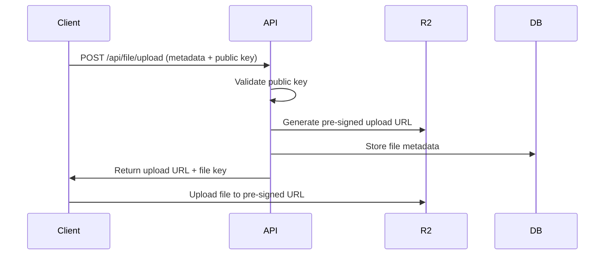
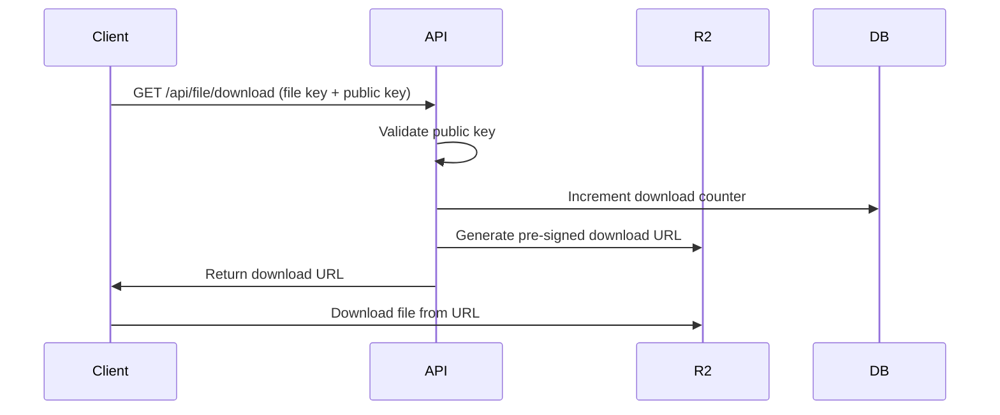

# File Service Infrastructure - Technical Documentation

## Overview

The File Service Infrastructure is a backend service designed for file storage and management, providing a robust API for file operations such as upload, download, and metadata retrieval. This service is built to be reusable across different applications and services within the organization, promoting consistency and reducing duplication of effort.

## Architecture

### Design Principles

The system follows Domain-Driven Design (DDD) principles with a clear separation of concerns:

- **Controllers**: Handle HTTP requests and orchestrate business logic
- **Services**: Contain business logic and domain operations
- **Repositories**: Handle data access and persistence

### System Architecture

```
┌─────────────────┐    ┌─────────────────┐    ┌─────────────────┐
│   Controllers   │───▶│    Services     │───▶│  Repositories   │
└─────────────────┘    └─────────────────┘    └─────────────────┘
         │                       │                       │
         │                       │                       │
         ▼                       ▼                       ▼
┌─────────────────┐    ┌─────────────────┐    ┌─────────────────┐
│  HTTP Requests  │    │ Business Logic  │    │   Data Layer    │
└─────────────────┘    └─────────────────┘    └─────────────────┘
```

## Tech Stack

- **Runtime**: Node.js
- **Framework**: Express.js
- **Language**: TypeScript
- **Database**: MongoDB
- **File Storage**: Cloudflare R2
- **Authentication**: JWT tokens
- **Authorization**: Public/Private key pairs per bucket
- **Caching**: In-memory cache for key validation

## Data Models

### User
```typescript
interface User {
  id: string;
  email: string;
  password: string; // hashed
  createdAt: Date;
  updatedAt: Date;
}
```

### Bucket
```typescript
interface Bucket {
  id: string;
  name: string;
  ownerId: string;
  publicKey: string;
  privateKey: string;
  createdAt: Date;
  updatedAt: Date;
}
```

### File
```typescript
interface File {
  id: string;
  bucketId: string;
  filename: string;
  originalName: string;
  size: number;
  mimeType: string;
  uploadedAt: Date;
  metadata: Record<string, any>;
  downloadCount: number;
}
```

## API Endpoints

### Admin Endpoints (`/app`)

#### Authentication
- `POST /app/admin/login` - Admin login with email and password
- `POST /app/admin/signup` - Admin registration

#### Bucket Management
- `GET /app/buckets` - List all buckets
- `GET /app/buckets/{bucketId}` - Get specific bucket details
- `GET /app/buckets/{bucketId}/files` - List files in bucket
- `GET /app/buckets/{bucketId}/files/{fileId}` - Get specific file details
- `POST /app/buckets/create` - Create new bucket (generates key pair)
- `POST /app/buckets/{bucketId}/upload` - Upload file to bucket

#### Dashboard
- `GET /app/dashboard` - Analytics dashboard with stats
- `GET /status` - Service health check

### Public API Endpoints (`/api`)

#### File Operations
- `POST /api/file/upload` - Get upload URL for Cloudflare R2 (requires public key)
- `GET /api/file/download` - Get download URL from Cloudflare R2 (requires public key)
- `GET /api/files` - List files for bucket (requires private key)

## Authentication & Authorization

### JWT Authentication
- Used for admin endpoints (`/app/*`)
- Tokens contain user ID and expiration
- Middleware validates tokens on protected routes

### Key-Based Authentication
- Each bucket has a unique public/private key pair
- Public keys: Used for file upload/download operations
- Private keys: Used for administrative operations (listing files)
- Keys are cached in memory for performance

## File Upload Flow



## File Download Flow



## Security Considerations

### Key Management
- Public/private key pairs are generated using cryptographically secure methods
- Keys are stored securely in the database
- Key validation is cached to improve performance
- Keys should be rotated periodically (future enhancement)

### Data Protection
- All passwords are hashed using bcrypt
- JWT tokens have expiration times
- Pre-signed URLs have limited validity periods
- Input validation on all endpoints

### Access Control
- Bucket-level isolation using key pairs
- Admin authentication required for management operations
- Rate limiting should be implemented (future enhancement)

## Performance Considerations

### Caching Strategy
- Public/private key validation cached in memory
- Consider implementing Redis for distributed caching
- File metadata caching for frequently accessed files

### Database Optimization
- Indexes on frequently queried fields (bucketId, fileId, etc.)
- Connection pooling for MongoDB
- Consider read replicas for high-traffic scenarios

## Monitoring & Observability

### Metrics to Track
- Upload/download success rates
- Response times for each endpoint
- Storage usage per bucket
- Authentication failure rates
- Error rates by endpoint

### Logging
- Structured logging with correlation IDs
- Request/response logging
- Error tracking and alerting
- Audit logs for administrative actions

## Deployment

### Environment Variables
```
NODE_ENV=production
PORT=3000
MONGODB_URI=mongodb://...
CLOUDFLARE_ACCOUNT_ID=...
CLOUDFLARE_ACCESS_KEY_ID=...
CLOUDFLARE_SECRET_ACCESS_KEY=...
R2_BUCKET_NAME=...
JWT_SECRET=...
```

### Docker Configuration
```dockerfile
FROM node:18-alpine
WORKDIR /app
COPY package*.json ./
RUN npm ci --only=production
COPY . .
RUN npm run build
EXPOSE 3000
CMD ["npm", "start"]
```

## Future Enhancements

### High Priority
- Implement rate limiting
- Add comprehensive error handling
- Set up monitoring and alerting
- Add input validation middleware
- Implement key rotation mechanism

### Medium Priority
- Add file versioning
- Implement soft deletes
- Add bulk operations
- Create admin dashboard UI
- Add file preview generation

### Low Priority
- Multi-region deployment
- Advanced analytics
- Webhook notifications
- File sharing with time-limited tokens
- Integration with external auth providers

## Development Setup

### Prerequisites
- Node.js 18+
- MongoDB
- Cloudflare R2 account

### Installation
```bash
npm install
cp .env.example .env
# Configure environment variables
npm run build
npm run dev
```

### Testing
```bash
npm run test
npm run test:integration
npm run test:coverage
```

## API Response Formats

### Success Response
```json
{
  "success": true,
  "data": {...},
  "message": "Operation completed successfully"
}
```

### Error Response
```json
{
  "success": false,
  "error": {
    "code": "ERROR_CODE",
    "message": "Human readable error message",
    "details": {...}
  }
}
```

## Troubleshooting

### Common Issues
1. **Authentication failures**: Check JWT token validity and key pairs
2. **Upload failures**: Verify Cloudflare R2 configuration and permissions
3. **Database connection issues**: Check MongoDB connection string and network access
4. **Performance issues**: Review caching configuration and database indexes